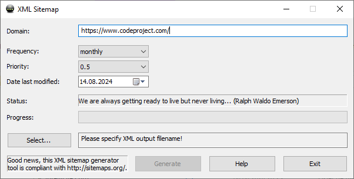

# XML Sitemap
Sitemaps provide a way for you to tell search engines about the pages on your website that might not otherwise be found, as well as provide additional supporting information about the pages.
They are essentially a structured list of all the pages in your website.
As well as the list of pages you can advise search engines on when the page was last updated, how often it is updated and the relative priority of each page within your website.

## Why Get a Sitemap?
Sitemaps help you improve your search engine coverage and ranking. If you verify ownership of your website with search engines such as Google and Bing, you can access a wealth of information about how Google sees your website and how visitors are finding you.
-   Maximise your search engine coverage and ranking;
-   Improve the speed with which your pages get listed;
-   Take advantage of Google and Bing webmaster tools;
-   Google how Google crawls, indexes and ranks your site;
-   Analyze search data to see how many people find you.

## XML Sitemaps
XML sitemaps are the preferred option for detailing your website and contain more detail to inform the search engines about the structure of your website.
The core elements of an XML Sitemap are:
-   Web page address;
-   Last modified date;
-   Update frequency;
-   Relative priority within your site.
```xml
<?xml  version="1.0"  encoding="UTF-8"?>
<urlset  xmlns="http://www.sitemaps.org/schemas/sitemap/0.9">
    <url>
        <loc>http://www.example.com/</loc>
        <lastmod>2005-01-01</lastmod>
        <changefreq>monthly</changefreq>
        <priority>0.8</priority>
    </url>
</urlset>
```
XML Sitemaps can also be extended to include details about media content in your pages such as images.

## RSS Sitemaps
RSS feeds are typical about informing search engines, directories and your users about new and updated content although they can also be used to detail all the pages in your website.
The good thing about RSS feeds is that you can list all your new and updated webpages and submit them to the search engines and directories to improve the inclusion of new content.
```rss
<channel>
    <title>Website name</title>
    <link>http://www.xmlwitemapgenerator.com</link>
    <description>Website description here</description>
    <item>
        <title>A Sitemap entry</title>
        <link>http://www.xmlwitemapgenerator.com/example</link>
        <description>Sitemap entry description</description>
    </item>
    <item>
        <title>Another item</title>
        <link>http://www.xmlwitemapgenerator.com/xml</link>
        <description>Another entry description</description>
    </item>
</channel>
```
## HTML Sitemaps
HTML sitemaps are traditional web pages that provide a structured list of webpages in your website.
They are more accessible to people but also help search engines finding pages in your website.
Unlike RSS and XML sitemaps, HTML sitemaps do not contain the same meta data about your pages.
